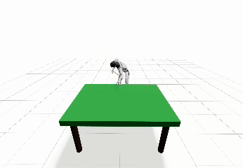
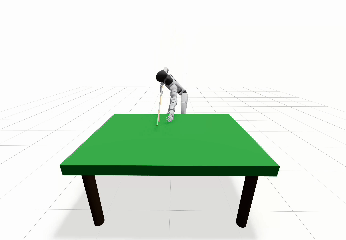
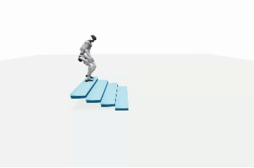
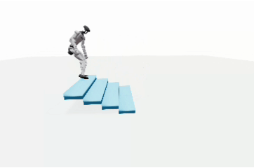
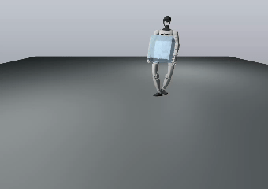
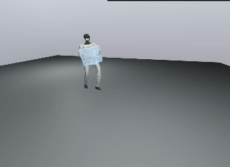

# Better_Holosoma
Optimized version of Holosoma

## Task1: play snooker

| Holosoma | GMR |
| --- | --- |
|  |  |
|  The cue is stably supported on the hand and can be driven back and forth with precise control. | Inaccurate wrist posture constraints cause the cue to wobble and drift. |

## Task2: climb stairs

| Holosoma | GMR |
| --- | --- |
|  |  |
| The robot’s foot lands fully on each step with consistent placement. | Inaccurate foot-pose constraints lead to incorrect foothold placement. |

## Task3: move box

| Holosoma | GMR |
| --- | --- |
|  |  |
| The robot moves the box with correct whole-body coordination, especially proper hand orientation. | Hand–box interpenetration occurs. |

